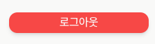
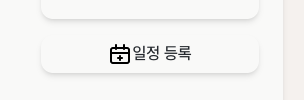
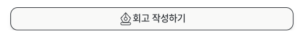
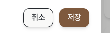
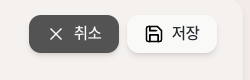
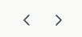

# Button

Button 에서 사용하는 버튼의 종류는 총 5개입니다.

|     이름     | 사진                                      | 설명                             |
|:----------:|-----------------------------------------|:-------------------------------|
|  사용자 모달 창  |                      | 사용자 정보창에 있는 로그아웃 버튼입니다.        |
|     달력     |                      | 메인 페이지인 달력의 일정 등록 버튼입니다.       |
|  일정 상세 조회  |                      | 일정 상세 조회 버튼에 있는 회고 작성하기 버튼입니다. |
| 저장 및 취소 버튼 |   | 어디서든 사용되고 있는 저장 및 취소 버튼입니다.    |
|   화살표 버튼   |                      | 주로 달력 페이지에서 보이는 화살표 버튼입니다.     |

각 버튼마다 특징으로는 다음과 같습니다.

1. `$bgColor` 색상을 가지고 있을 수 있다.
   > 기본값으로는 `white`입니다.
2. `$outline` 외부 테두리를 가지고 있을 수 있다.
   > 기본값으로는 outline이 존재하지 않습니다.

그 외의 기본적인 특징으로는 크기를 조절할 수 있습니다. 