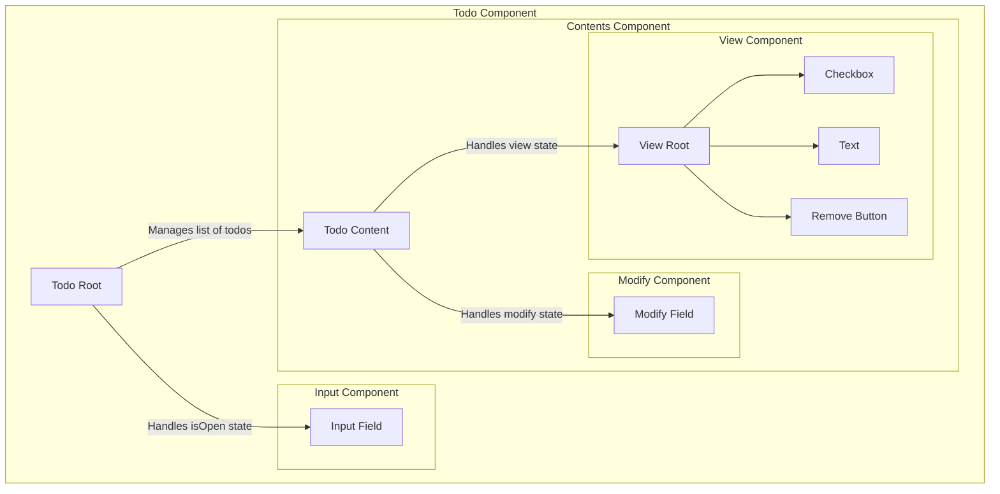

# TODO

```mermaid
flowchart TD

    subgraph Todo["Todo Component"]
        TODO["Todo Root"]
        
        subgraph Input["Input Component"]
            INPUT["Input Field"]
        end

        subgraph Contents["Contents Component"]
            CONTENT["Todo Content"]
            
            subgraph Modify["Modify Component"]
                MODIFY["Modify Field"]
            end

            subgraph View["View Component"]
                VIEW["View Root"]

                Checkbox
                Text
                Remove["Remove Button"]
            end
        end
    end

    TODO -- "Handles isOpen state" --> INPUT
    TODO -- "Manages list of todos" --> CONTENT

    CONTENT -- "Handles view state" --> VIEW
    CONTENT -- "Handles modify state" --> MODIFY

    VIEW --> Checkbox
    VIEW --> Text
    VIEW --> Remove
```
