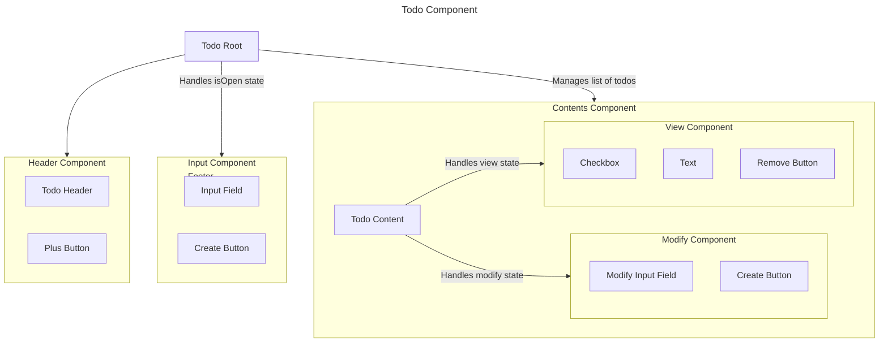

# TODO

## Component

```mermaid
---
title: "Todo Component"
---
flowchart TD
    
    TODO["Todo Root"]
    
    subgraph Header["Header Component"]
        HEADER["Todo Header"]
        HPB["Plus Button"]
    end


    subgraph Contents["Contents Component"]
        CONTENT["Todo Content"]
        
        subgraph Modify["Modify Component"]
            MODIFY["Modify Input Field"]
            MCB["Create Button"]
        end

        subgraph View["View Component"]
            Checkbox
            Text
            Remove["Remove Button"]
        end
    end

    subgraph Input["Input Component </br> Footer"]
        INPUT["Input Field"]
        ICB["Create Button"]
    end


    TODO --> Header
    TODO -- "Handles isOpen state" --> Input
    TODO -- "Manages list of todos" --> Contents

    CONTENT -- "Handles view state" --> View
    CONTENT -- "Handles modify state" --> Modify
```
